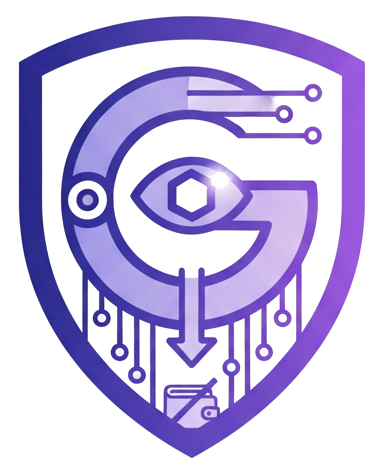

<div align="center">
  
  
  
  # 🛡️ Gurftron
  
  ### **AI-Powered Phishing Protection with Gamified Rewards on Starknet** 🚀
  
  [](https://www.rust-lang.org/)
  [](https://www.cairo-lang.org/)
  [](https://www.starknet.io/)
  [](LICENSE)
  [](https://gurftron.work.gd)
  
  ---
  
  🔐 **Secure** · 🤖 **AI-Powered** · 💰 **Earn Rewards** · 🌐 **Decentralized** · ⚡ **Real-time Protection**
  
  **🌐 [Visit Our Website](https://gurftron.work.gd)** | **📖 [Documentation](#-getting-started)** | **💬 [Report Issues](https://github.com/mitmelon/gurftron/issues)**
  
</div>

## 🌟 About

Gurftron is a next-generation browser security extension that combines artificial intelligence, community-driven threat detection, and blockchain-based incentives to protect users from phishing attacks, malware, and malicious websites. Built on Starknet, Gurftron rewards users with STRK tokens for identifying and voting on threats, creating a decentralized security ecosystem.

---

## 📑 Table of Contents

- [🌟 About](#-about)
- [⚠️ The Problem](#️-the-problem)
- [💡 Our Solution](#-our-solution)
- [✨ Why Gurftron?](#-why-gurftron)
- [👥 Who Benefits?](#-who-benefits)
- [⚙️ How It Works](#️-how-it-works)
- [🛠️ Tech Stack](#️-tech-stack)
- [🚀 Getting Started](#-getting-started)
  - [📋 Prerequisites](#-prerequisites)
  - [🏗️ Step 1: Deploy Smart Contract](#️-step-1-deploy-smart-contract)
  - [🔧 Step 2: Build Chrome Extension](#-step-2-build-chrome-extension)
  - [🦀 Step 3: Install Rust Security Engine](#-step-3-install-rust-security-engine)
  - [🖥️ Step 4: Start Backend Server](#️-step-4-start-backend-server)
  - [⚡ Step 5: Configure Extension](#-step-5-configure-extension)
- [💰 Earning Rewards](#-earning-rewards)
- [📁 Project Structure](#-project-structure)
- [🤝 Contributing](#-contributing)
- [📄 License](#-license)

---

## ⚠️ The Problem

Online threats are evolving faster than traditional security solutions can adapt:

- 🎣 **Phishing attacks** cost businesses and individuals billions annually
- ⚡ **Zero-day threats** appear before antivirus databases are updated
- 🏢 **Centralized security** relies on single points of failure
- 🚫 **No incentives** exist for users to actively participate in threat detection
- 🐌 **Slow response times** from traditional security vendors
- 🔒 **Privacy concerns** with cloud-based scanning services

Users are left vulnerable, with no way to contribute to or benefit from collective security intelligence.

---

## 💡 Our Solution

Gurftron creates a **decentralized security network** where users are both protected and rewarded:

1. 🤖 **AI-Powered Detection**: Multiple AI models (Gemini, Local LLMs) analyze websites in real-time
2. 🔍 **Multi-Layer Scanning**: Integration with Google Safe Browsing, AbuseIPDB, Brave Search, and ClamAV
3. 🗳️ **Community Validation**: Users vote on detected threats, earning STRK tokens for accurate assessments
4. ⛓️ **Blockchain Storage**: Threat data stored on Starknet with immutable records
5. 📁 **Native File Scanning**: Real-time malware detection through integrated ClamAV engine
6. ⭐ **Reputation System**: Build credibility through consistent, accurate threat reporting

---

## ✨ Why Gurftron?

### 👤 For Users
- 💰 **Get paid** to browse safely (earn STRK tokens)
- ⚡ **Real-time protection** against phishing and malware
- 🔐 **Privacy-first**: Your browsing stays local; only threats are reported
- 🗳️ **Community power**: Your votes shape the threat database
- 🛡️ **Multi-layered security**: AI + community + traditional antivirus

### 🌐 For the Ecosystem
- 🔄 **Decentralized threat intelligence** that no single entity controls
- 🚀 **Faster response** to emerging threats through crowd wisdom
- 💎 **Economic incentives** align user behavior with network security
- 📊 **Transparent records** of all threats and validations on-chain
- 🔓 **Reduced dependence** on centralized security vendors

### 💻 For Developers
- 🌍 **Open-source**: Full transparency and community contributions
- 🔌 **Extensible**: Add new AI models, scanners, or features
- 📚 **Well-documented**: Clear setup and contribution guides
- 🌈 **Multi-platform**: Works on Chrome, Edge, Brave, Firefox

---

## 👥 Who Benefits?

### 👥 Everyday Users
- 🛡️ Protection while browsing
- 💸 Passive income through threat reporting
- 🔐 Control over their security data

### 🏢 Businesses
- 👔 Enhanced employee protection
- 📉 Reduced phishing success rates
- 🌐 Decentralized security posture

### 🔐 Security Researchers
- 📡 Platform to share threat intelligence
- 💰 Rewards for valuable contributions
- ⭐ Reputation building in the community

### 💻 Web3 Enthusiasts
- 🎯 Real-world utility for blockchain technology
- 🗳️ Active participation in decentralized governance
- 💎 Staking and earning opportunities

### 🌐 Internet at Large
- 🤝 Collective immunity through shared threat data
- ⚡ Faster detection of emerging threats
- 🌍 Democratized security infrastructure

---

## ⚙️ How It Works

```
┌─────────────┐
│   🌐 Browser   │
│  Extension  │◄─── 👤 User browses the web
└──────┬──────┘
       │
       ├─► 🤖 AI Analysis (Gemini/Local)
       ├─► 🔍 API Checks (Safe Browsing, AbuseIPDB, etc.)
       ├─► 🦠 File Scanning (ClamAV via Rust Engine)
       │
       ▼
  ⚠️ Threat Detected?
       │
       ├─ ✅ No ──► Continue browsing
       │
       └─ 🚨 Yes ──► Block & Report to Smart Contract
                        │
                        ▼
               ┌────────────────────┐
               │  ⛓️ Starknet Contract │
               │   (Pending State)  │
               └────────┬───────────┘
                        │
                        ▼
               🗳️ Community Votes (Validate/Reject)
                        │
                   60% Approve?
                        │
           ┌────────────┴────────────┐
           │                         │
          ✅ Yes                    ❌ No
           │                         │
           ▼                         ▼
    🎯 Threat Confirmed       🚫 Rejected/Ignored
           │
           ▼
    💰 Rewards Distributed:
    • Reporter: 10 points (0.1 STRK)
    • Voters: 2 points each (0.02 STRK)
    • Premium users: 2x rewards
```

---

## 🛠️ Tech Stack

### 🎨 Frontend
- 🌐 **Extension**: Vanilla JavaScript with Chrome Extension Manifest V3
- 💅 **UI**: TailwindCSS for modern, responsive design
- 💾 **Storage**: Dexie.js (IndexedDB wrapper) for local caching

### ⚙️ Backend
- 📜 **Smart Contract**: Cairo 2.8.0 on Starknet
- 🦀 **Security Engine**: Rust with Tokio async runtime
- 🖥️ **Server**: Fastify (Node.js) for contract write proxy
- 🗄️ **Database**: MongoDB for event aggregation, SQLite for scan caching
- 🔌 **APIs**: 
  - 🔍 Google Safe Browsing
  - 🚫 AbuseIPDB
  - 🔎 Brave Search
  - 🤖 Gemini for AI analysis

### ⛓️ Blockchain
- 🌐 **Network**: Starknet (Sepolia testnet, Mainnet ready)
- 👛 **Wallet Integration**: ArgentX, Braavos via get-starknet
- 💎 **Token**: STRK for staking and rewards

### 🔐 Security
- 🦠 **Antivirus**: ClamAV for file scanning
- 🔐 **Hashing**: SHA-256 for file integrity
- 🔗 **Native Messaging**: Secure browser-to-native communication

---

## 🚀 Getting Started

### Prerequisites

Before you begin, ensure you have:

- **Node.js** (v18 or higher): [Download](https://nodejs.org/)
- **Rust** (latest stable): [Install Rustup](https://rustup.rs/)
- **Scarb** (Cairo toolchain): [Install Scarb](https://docs.swmansion.com/scarb/)
- **Starknet Foundry** (sncast): [Install Guide](https://foundry-rs.github.io/starknet-foundry/)
- **MongoDB** (for backend server): [Download](https://www.mongodb.com/try/download/community)
- **ClamAV** (automatic on first run, or [manual install](https://www.clamav.net/downloads))
- **Starknet Wallet** (ArgentX or Braavos browser extension)
- **Git**: For cloning the repository

### 🏗️ Step 1: Deploy Smart Contract

The smart contract manages threat validation, voting, and reward distribution. ⛓️

**Detailed instructions**: See [`contracts/README.md`](contracts/README.md)

**Quick Start:**

```bash
# Navigate to contracts directory
cd contracts

# Build the contract
scarb build

# Create deployment account
sncast account create --network sepolia --name deployer

# Fund account from faucet
# Visit: https://starknet-faucet.vercel.app/

# Deploy account
sncast account deploy --network sepolia --name deployer

# Declare contract
sncast declare --network sepolia --contract-name GurftronDB

# Deploy contract (save the contract address!)
sncast deploy --network sepolia \
  --class-hash YOUR_CLASS_HASH \
  --constructor-calldata YOUR_ADMIN_ADDRESS STRK_TOKEN_ADDRESS
```

**Save your deployed contract address** - you'll need it for the extension configuration!

**Default Rewards (configurable by admin):**
- Insert threat: **10 points** = **0.1 STRK**
- Vote on threat: **2 points** = **0.02 STRK**
- Premium users: **2x multiplier**
- Minimum to claim: **1000 points** = **10 STRK**

---

### 🔧 Step 2: Build Chrome Extension

The extension monitors browsing activity and scans for threats. 🌐

```bash
# Clone repository (if you haven't already)
git clone https://github.com/mitmelon/gurftron.git
cd gurftron

# Install dependencies
npm install

# Build CSS with TailwindCSS
npm run build:css

# Build extension for production
npm run build

# Or for development with auto-rebuild
npm run dev
```

**Install in Browser:**

1. Open Chrome and navigate to `chrome://extensions/`
2. Enable **Developer mode** (top right toggle)
3. Click **Load unpacked**
4. Select the `dist` folder from your build output
5. Pin the extension to your toolbar for easy access

**Verify Installation:**
- You should see the Gurftron icon in your browser toolbar
- Click it to open the dashboard
- You'll be prompted to complete setup on first launch

---

### 🦀 Step 3: Install Rust Security Engine

The Rust engine provides native file scanning via ClamAV. 🔐

**Detailed instructions**: See [`program/guftron_engine/README.md`](program/guftron_engine/README.md)

**Quick Start:**

```bash
# Navigate to engine directory
cd program/guftron_engine

# Build for production
cargo build --release

# Run first-time setup
./target/release/gurftron_engine
# (Windows: .\target\release\gurftron_engine.exe)
```

**What Happens:**
1. Checks for ClamAV installation (auto-installs on Windows)
2. Starts ClamAV daemon
3. Updates virus definitions
4. Registers native messaging with your browsers
5. Creates SQLite database for scan caching

**Verify Installation:**
```bash
# Test the engine
echo '{"action":"ping"}' | ./target/release/gurftron_engine
# Should return: {"result":"success",...}
```

The engine now runs automatically when the extension needs to scan files.

---

### 🖥️ Step 4: Start Backend Server

The backend server handles contract write operations and event aggregation. 🚀

**Quick Start:**

```bash
# Navigate to server directory
cd gurftron-server

# Create .env file in root directory
cd ..
touch .env  # (Windows: type nul > .env)
```

**Configure .env file** (in root directory):

```env
# MongoDB Connection
MONGODB_URI=mongodb://localhost:27017/gurftron

# Starknet Configuration
STARKNET_RPC_URL=your_rpc_endpoint
WALLET_PRIVATE_KEY=your_private_key_here
WALLET_ADDRESS=your_account_address_here
CONTRACT_ADDRESS=your_deployed_contract_address_here
NETWORK=sepolia

# API Security
API_KEY=your_secret_api_key_here

# Server Configuration
PORT=3000
```

**Start MongoDB** (if running locally):

```bash
# Windows
mongod

# macOS (with Homebrew)
brew services start mongodb-community

# Linux
sudo systemctl start mongod
```

**Start the Server:**

```bash
# From root directory
npm start

# Or for development with auto-reload
npm run devServer
```

**What the Server Does:**
1. Proxies contract write operations from extension
2. Aggregates and stores blockchain events
3. Manages transaction history
4. Provides API for contract interactions
5. Handles rate limiting and authentication

**Verify Server:**
```bash
# Should see:
# Server listening at http://0.0.0.0:3000
# Connected to MongoDB
```

**Server Endpoints:**
- `GET /health` - Health check
- `POST /contract/write` - Execute contract write operations
- `GET /events/:walletAddress` - Fetch user events
- `GET /requests/:walletAddress` - Get transaction history

**Important Notes:**
- Keep your `STARKNET_PRIVATE_KEY` secure and never commit to git
- The API_KEY should match what you enter in extension settings
- Server must be running for contract write operations (inserts, votes)
- MongoDB must be accessible at the URI specified

---

### ⚡ Step 5: Configure Extension

Now connect everything together! 🎯

#### A. Initial Setup

1. **Open Extension**: Click the Gurftron icon in your browser
2. **Install Page**: You'll see the installation welcome screen
3. **Click "Get Started"**: Proceed to login

#### B. Connect Wallet

1. **Choose Wallet**: Select ArgentX or Braavos
2. **Connect**: Authorize the connection request
3. **Sign In**: Sign the authentication message
4. **Dashboard**: You're now at the main dashboard

#### C. Configure API Keys

1. **Navigate to Settings**: Click the gear icon or go to Settings from the sidebar
2. **Enter API Keys** (get free keys from these providers):

   - **Gemini API** (Required for AI analysis)
     - Get key: [Google AI Studio](https://aistudio.google.com/app/apikey)
     - Paste into "Gemini API Key" field
     - Click "Save"

   - **Google Safe Browsing** (Recommended)
     - Get key: [Google Cloud Console](https://console.cloud.google.com/)
     - Enable "Safe Browsing API"
     - Paste into "Google Safe Browsing API Key"
     - Click "Save"

   - **AbuseIPDB** (Optional but recommended)
     - Get key: [AbuseIPDB](https://www.abuseipdb.com/api)
     - Paste into "AbuseIPDB API Key"
     - Click "Save"

   - **Brave Search** (Optional)
     - Get key: [Brave Search API](https://brave.com/search/api/)
     - Paste into "Brave Search API Key"
     - Click "Save"

3. **Select LLM Type**: Choose your preferred AI model:
   - `gemini` - Google's Gemini (recommended, requires API key)
   - `local` - Local LLM (privacy-focused, slower)

4. **Save Configuration**: Each setting saves independently

#### D. Configure Server Connection

Connect the extension to your backend server:

1. **Server URL**: Enter your server URL (e.g., `http://localhost:3000`)
   - Click "Save"
   
2. **Server API Key**: Enter the API_KEY from your `.env` file
   - Click "Save"

This enables the extension to submit threats and votes to the smart contract through your server.

#### E. Enter Smart Contract Address (Optional)

If you deployed your own contract:

1. Open the extension's `contract-writer.js` or settings
2. Update the contract address to your deployed address
3. Save and restart the extension

---

## 💰 Earning Rewards

Once configured, Gurftron automatically protects you and earns rewards! 🎉

### 🎯 How to Earn

1. 🌐 **Browse Normally**: Gurftron monitors in the background
2. 🚨 **Threats Detected**: AI analyzes and blocks suspicious sites
3. 📝 **Auto-Report**: Threats are submitted to the smart contract
4. 🗳️ **Community Votes**: Other users validate your findings
5. 💎 **Earn STRK**: Get rewards when threats are confirmed

### 🗳️ Voting on Threats

1. 📊 **Dashboard**: View pending threats requiring validation
2. 🔍 **Review**: Check threat details, URLs, and AI analysis
3. ✅ **Vote**: Approve (valid threat) or Reject (false positive)
4. 💰 **Earn Points**: 2 points per vote when you're in the majority

### Reward Structure

| Action | Points | STRK Value | Requirements |
|--------|--------|------------|--------------|
| Report threat | 10 | 0.1 STRK | Threat approved by community |
| Vote on threat | 2 | 0.02 STRK | Vote with majority |
| Stake tokens | Varies | - | Unlock voting rights |
| Premium status | 2x | - | Set by admin |

**Minimum to Claim**: 1000 points (10 STRK)

**Approval Threshold**: 60% of votes must be positive

### Staking for Access

To report threats and vote, you must stake STRK:

1. **Minimum Stake**: 10 STRK
2. **Lock Period**: 30 days
3. **Purpose**: Prevents spam and malicious reports
4. **Withdrawal**: Available after lock period

**Stake from Dashboard:**
1. Go to "Staking" section
2. Enter amount (minimum 10 STRK)
3. Approve and confirm transaction
4. Wait for confirmation

### Reputation System

Build reputation through quality contributions:

- **Positive**: Approved threats, accurate votes
- **Negative**: Rejected threats, minority votes, malicious activity
- **Minimum**: -100 (below this, you can't participate)
- **Benefits**: Higher reputation = more trust = potential premium status

---

## Project Structure

```
gurftron/
├── contracts/                  # Starknet smart contract
│   ├── src/
│   │   └── lib.cairo          # Main contract code
│   ├── Scarb.toml             # Contract dependencies
│   └── README.md              # Contract build & deploy guide
│
├── program/
│   └── guftron_engine/        # Rust security engine
│       ├── src/
│       │   └── main.rs        # Native messaging & ClamAV
│       ├── Cargo.toml         # Rust dependencies
│       └── README.md          # Engine build guide
│
├── src/                       # Chrome extension source
│   ├── background.js          # Service worker
│   ├── content.js             # Content script injector
│   ├── dashboard.html         # Main dashboard UI
│   ├── dashboard.js           # Dashboard logic
│   ├── settings.html          # Settings page
│   ├── login.html             # Wallet connection
│   ├── gurftron.js            # Core threat detection
│   ├── starknet.js            # Blockchain interactions
│   ├── contract-writer.js     # Smart contract calls
│   ├── dexieStorage.js        # Local database
│   └── images/                # Icons and assets
│
├── dist/                      # Built extension (after npm run build)
│
├── gurftron-server/           # Optional backend server
│   └── server.js
│
├── manifest.json              # Extension manifest (Manifest V3)
├── package.json               # Node dependencies
├── webpack.config.js          # Build configuration
├── tailwind.config.js         # TailwindCSS config
└── README.md                  # This file
```

---

## API Keys Setup

### Required APIs

#### Gemini API (Required)
- **Purpose**: AI-powered website analysis
- **Get Key**: [Google AI Studio](https://aistudio.google.com/app/apikey)
- **Free Tier**: 60 requests per minute
- **Cost**: Free for moderate use

### Recommended APIs

#### Google Safe Browsing
- **Purpose**: Check URLs against Google's threat database
- **Get Key**: [Google Cloud Console](https://console.cloud.google.com/)
- **Setup**: Enable "Safe Browsing API" in your project
- **Free Tier**: 10,000 requests/day

#### AbuseIPDB
- **Purpose**: Validate IP addresses for malicious activity
- **Get Key**: [AbuseIPDB Registration](https://www.abuseipdb.com/api)
- **Free Tier**: 1,000 requests/day

### Optional APIs

#### Brave Search
- **Purpose**: Enhanced search-based threat detection
- **Get Key**: [Brave Search API](https://brave.com/search/api/)
- **Free Tier**: Available with registration

---

## Development

### Running in Development Mode

```bash
# Terminal 1: Watch and rebuild extension
npm run dev

# Terminal 2 (optional): Run backend server
npm run devServer
```

### Testing

```bash
# Test smart contract
cd contracts
scarb test

# Test Rust engine
cd program/guftron_engine
cargo test

# Manual extension testing
# Load unpacked extension in Chrome and test UI flows
```

### Building for Production

```bash
# Build everything
npm run build:css
npm run build

# Build contract
cd contracts && scarb build

# Build engine
cd program/guftron_engine && cargo build --release
```

---

## Contributing

We welcome contributions! Here's how:

1. **Fork** the repository
2. **Create** a feature branch (`git checkout -b feature/amazing-feature`)
3. **Commit** your changes (`git commit -m 'Add amazing feature'`)
4. **Push** to the branch (`git push origin feature/amazing-feature`)
5. **Open** a Pull Request

### Areas for Contribution

- 🔧 Additional AI model integrations
- 🌐 Multi-language support
- 🎨 UI/UX improvements
- 🔐 New security scanner integrations
- 📖 Documentation enhancements
- 🐛 Bug fixes and optimizations

---

## Troubleshooting

### Extension Not Working

- **Check wallet connection**: Ensure ArgentX/Braavos is installed and connected
- **Verify API keys**: Go to Settings and confirm all keys are saved
- **Reload extension**: Go to `chrome://extensions/` and click reload
- **Check console**: Right-click extension → Inspect → Check for errors

### Rust Engine Issues

- **ClamAV not starting**: Manually install ClamAV for your OS
- **Native messaging error**: Re-run the engine to re-register
- **Port 3310 busy**: Another ClamAV instance is running, restart it
- See [`program/guftron_engine/README.md`](program/guftron_engine/README.md) for detailed troubleshooting

### Smart Contract Issues

- **Transaction fails**: Ensure you have enough STRK for gas
- **Stake rejected**: Minimum stake is 10 STRK
- **Can't vote**: Check if you've staked and passed lock period
- See [`contracts/README.md`](contracts/README.md) for deployment issues

### API Issues

- **Rate limits**: Most APIs have free tier limits, upgrade if needed
- **Invalid key**: Regenerate keys from provider dashboards
- **CORS errors**: Some APIs require backend proxy (use `gurftron-server`)

---

## Security Considerations

- **Private keys**: Never share your wallet private keys
- **API keys**: Store securely, don't commit to public repos
- **Smart contract**: Audit before mainnet deployment
- **Staking**: Only stake what you can afford to lock for 30 days
- **Voting**: Bad-faith voting can result in reputation loss

---

## Roadmap

- [x] MVP with AI detection and ClamAV integration
- [x] Starknet smart contract with voting system
- [x] Chrome extension with wallet integration
- [ ] Vesu integration for rewards sustainability
- [ ] Local ML models for privacy users
- [ ] Whitelist inclusion
- [ ] Deep fake detection in video & images
- [ ] Firefox and Edge support
- [ ] Mobile app (React Native)
- [ ] DAO governance for system parameters
- [ ] Cross-chain support (Bsc, Polygon)
- [ ] Enterprise API for businesses
- [ ] Threat intelligence marketplace

---

## License

This project is licensed under the ISC License. See individual components for specific license details:

- Smart Contract: MIT License
- Rust Engine: Check source file headers
- Extension: ISC License

---

## 💬 Support & Community

- 🌐 **Website**: [gurftron.work.gd](https://gurftron.work.gd)
- 🐛 **GitHub Issues**: [Report bugs](https://github.com/mitmelon/gurftron/issues)
- 📖 **Documentation**: See component READMEs for detailed guides
- 📜 **Smart Contract**: [`contracts/README.md`](contracts/README.md)
- 🦀 **Rust Engine**: [`program/guftron_engine/README.md`](program/guftron_engine/README.md)

---

## 🙏 Acknowledgments

Built with:
- 🦀 Rust & Tokio
- 🏛️ Cairo & Starknet
- 🤖 AI (Gemini, Local LLMs)
- 🛡️ ClamAV
- ⚡ Node.js & Webpack
- 🎨 TailwindCSS

---

**🌐 Visit [gurftron.work.gd](https://gurftron.work.gd) · Start protecting the web and earning rewards today!** 🚀
